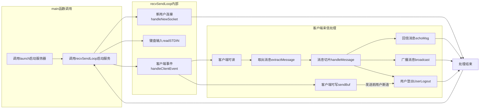
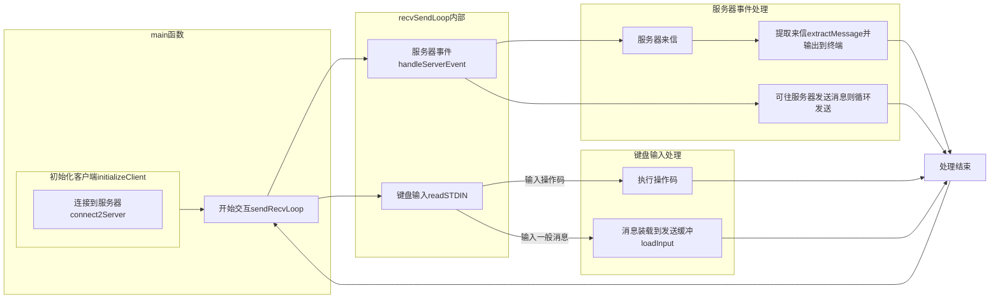

[toc]

# 基于封装的echo聊天程序实现
## 引言
&ensp;&ensp;&ensp;&ensp;在Linux C++环境下的socket编程入门时，通常使用sys/socket.h库作为网络编程库，并以构建echo聊天程序为首个项目，辅以epoll库或多线程等方式实现程序。然而，构建代码的过程中，经常需要判断函数是否正常返回以及处理异常情况，使得代码被众多判断语句与错误处理分隔，可读性下降。为了解决该问题，本文旨在实现一个echo聊天程序，通过封装socket与epoll库提高代码可读性，并提供一些可选优化，如引入`spdlog`记录服务器日志。本文假设读者对Linux C++环境下的socket编程有基本了解。
本文主要分为以下部分：
1. 给出原生库实现的服务器为例，分析直接使用原生库的问题。
2. 封装socket与epoll库的相关函数，简化服务器与客户端代码。
3. 基于封装实现echo聊天程序。
4. 提供一些可选优化。
5. 总结。
## 1. 原生socket服务器实现与问题分析
&ensp;&ensp;&ensp;&ensp;本章给出一个基于原生socket的echo服务器的实现，随后引入原生epoll，再分析原生API实现中存在的问题。
### 1.1. 基于原生socket的服务器实现
&ensp;&ensp;&ensp;&ensp;下列代码是一个最简便的socket echo服务器实现，其每次循环中只能接受一个客户端的请求，并且必须阻塞等待客户端连接，等待客户端发送数据。等待的过程中，服务器无法处理其他客户端的请求，无法断开与当前客户端的连接。
```cpp
#include <sys/socket.h>
#include <unistd.h>     //for close
#include <netinet/in.h> //for sockaddr_in
#include <stdlib.h>     //for exit

#include <iostream>

int main() {
    int socket_fd = socket(AF_INET, SOCK_STREAM, 0);
    if (socket_fd == 0) {
        std::cout << "Failed to create socket" << std::endl;
        exit(1);
    }
    
    sockaddr_in listen_addr{};
    listen_addr.sin_family = AF_INET;
    listen_addr.sin_addr.s_addr = INADDR_ANY;
    listen_addr.sin_port = htons(7070);

    if (bind(socket_fd, (sockaddr*)&listen_addr, sizeof(listen_addr)) == -1) {
        std::cout << "Failed to bind socket" << std::endl;
        exit(1);
    }

    if (listen(socket_fd, 5) == -1) {
        std::cout << "Failed to listen socket" << std::endl;
        exit(1);
    }

    while (true) {
        int client_fd = accept(socket_fd, nullptr, nullptr);
        if (client_fd == -1) {
            std::cout << "Failed to accept client, wait for next client" << std::endl;
            continue;
        } else {
            std::cout << "Client connected" << std::endl;
        }

        char buf[1024]{};
        ssize_t recv_len = recv(client_fd, buf, 1024, 0);
        if (recv_len == -1) {
            std::cout << "Failed to recv from client, wait for next client" << std::endl;
            close (client_fd);
            continue;
        }
        ssize_t send_len = send(client_fd, buf, recv_len, 0);
        if (send_len == -1) {
            std::cout << "Failed to send to client, wait for next client" << std::endl;
            close (client_fd);
            continue;
        }

        std::cout << "Client disconnect" << std::endl;
        close(client_fd);
    }

    close(socket_fd);
    return 0;
}
```
### 1.2 引入原生epoll的服务器框架
&ensp;&ensp;&ensp;&ensp;为解决[1.1](#11-基于原生socket的服务器实现)中纯socket服务器的问题，常见的做法是引入epoll库并将socket连接设为非阻塞。下列代码展示一个服务器引入epoll后的代码框架，该框架中服务器能够异步收发消息，从而实现与多客户端的交互。然而，这也使得代码问题更加严重，本文于1.3节中分析原生socket与原生epoll实现存在的问题。
```cpp
// 设置非阻塞
int socket_fd = socket(...);
int flags = fcntl(socket_fd, F_GETFL, 0);
if (flags == -1) {
    std::cout << "Failed to get fd flags" << std::endl;
    exit(1);
}
if (fcntl(socket_fd, F_SETFL, flags | O_NONBLOCK) == -1) {
    std::cout << "Failed to set fd flags" << std::endl;
    exit(1);
}
... // bind(), listen()
int epoll_fd = epoll_create1(0);
if (epoll_fd == -1) {
    std::cout << "Failed to create epoll" << std::endl;
    exit(1);
}

// 事件加入epoll监听
epoll_event ev{};
ev.data.fd = socket_fd;
ev.event = EPOLLIN;
if (epoll_ctl(epoll_fd, EPOLL_CTL_ADD, listen_fd, &ev) == -1) {
    std::cout << "Failed to add fd to epoll" << std::endl;
    exit(1);
}
std::unordered_map<int, std::string> clients;
while (true) {
    epoll_event events[20];
    int event_num = epoll_wait(event_fd, events, 20, -1);
    for (int i = 0; i < event_num; i++) {
        if (events[i] == listen_fd) {
            ... // accept()返回client_fd
            int flags = ... // 完整重复一次上述设置非阻塞的过程。
            epoll_event client_event{}; 
            ... // 完整重复一次上述事件加入epoll监听的过程。
            clients.insert({client_fd, ""});
        } else {
            ... // 客户端来信，服务器recv并send
            if (客户端断连条件) {
                if (epoll_ctl(epoll_fd, EPOLL_CTL_DEL, client_fd, nullptr) == -1) {
                    std::cout << "Failed to remove fd from epoll" << std::endl;
                    close(所有fd，包括clients中记录的fd);
                    exit(1);
                } else {
                    clients.erase(client_fd);
                    close(client_fd);
                }
            }
        }
    }
}
close(epoll_fd);
close(listen_fd);
```
### 1.3. 原生库实现问题分析
&ensp;&ensp;&ensp;&ensp;原生库实现中主要存在以下问题：
1. 原生库基于c语言编写，而本文所用语言为c++语言，在使用原生库过程中，无可避免地要处理char *字符串与C风格强制类型转换。这些操作在c++中被认为是不安全的，应当避免的。
2. 原生库函数以返回`-1`代表函数失败，并设置`errno`告诉程序员问题所在。这导致在代码实现中，掺杂了大量错误判断，本来应是连续的三行代码。例如socket $\rightarrow$ bind $\rightarrow$ listen连续三行处理socket套接字初始化，却都得加上if ( == -1) {}的错误处理。
3. 部分函数使用临时结构体，如`sockaddr_in`结构体，一般情况下其在`bind`、`connect`等函数调用后便会失效，而程序中却需要单独写3行对结构体内的数据进行赋值，这打断了代码的逻辑连贯性。
## 2. 封装socket与epoll库
&ensp;&ensp;&ensp;&ensp;为了简化服务器代码，降低socket与epoll的使用负担，本文决定将相关函数封装到类内，将修改epoll监听属性、fd设为非阻塞等内容封装到类内函数，并在类内处理函数出错的情况。此外，为了统一代码风格，函数参数与返回值尽量使用std::string、std::vector等c++内容，使得服务器与客户端维持在c++风格。
### 2.1. Socket类封装
#### 2.1.1. 封装实现
&ensp;&ensp;&ensp;&ensp;本文首先封装socket库为Socket类。首先，确认类所需的成员函数与成员变量，成员变量中无疑需要存储socket_fd，而根据第一章中服务器的简单实现，socket编程中客户端与服务器常用函数，本文认为Socket类需要封装的函数有：
1. 创建socket套接字。
2. 设置socket非阻塞。
3. 封装服务器使用的`bind`，`listen`，`accept`函数，以及允许地址重用的设置函数，即封装`setsockopt`。
4. 封装客户端使用的`connect`函数。
5. 收发消息函数。
6. 关闭fd。
7. 返回所封装的`socket fd`。
8. 获取连接对端地址，通过封装`getpeeraddr`函数实现。

&ensp;&ensp;&ensp;&ensp;其次，明确`Socket`类的职责：`Socket`类的设计为简化socket相关函数的使用，其本身不负责管理文件描述符的创建与关闭。在引入epoll的前提下，关闭socket fd的时机通常由连接本身与epoll监听确定，例如在用户断连时，`Socket`类不应直接关闭fd，而应该通过返回值通知epoll循环，在epoll中移除监听后再关闭fd。如果设计为RAII自动关闭fd，则可能出现先隐式关闭fd后从epoll移除fd的错误处理。也因此，`Socket`允许复制赋值与构造函数。
&ensp;&ensp;&ensp;&ensp;最后是封装的实现，具体实现见下方代码块。对于简单封装的函数不作过多介绍，基本是调用库函数后根据`errno`处理或者正常返回。在此简要介绍`Socket::recv`与`Socket::send`返回状态码：两者的状态码是一致的，`0`代表函数正常结束，`-1`代表过程中发现对端正常退出(通常在`::recv()`返回`0`时返回该状态码)以及`-2`代表过程中发现对端异常断连。之所以让这两个函数返回状态码，是因epoll循环中需要状态码判断用户离线，从用户列表中删除用户信息。**成员函数的完整定义见附录**
```cpp
class Socket {
public:
    Socket() = default;
    explicit Socket(int fd) : socket_fd_(fd) {}
    Socket(const Socket& other) : socket_fd_(other.socket_fd_) {}
    Socket(Socket&& other);
    
    // 使用默认析构函数, 代表析构Socket类的时候不会对socket进行close
    // 必须显式调用Socket.close()才能关闭socket
    ~Socket() = default;
    
    Socket& operator=(const Socket& other);
    Socket& operator=(Socket&& other);
    
    // 创建socket套接字，简单封装::socket()
    void create();                        
    // 服务器设置地址可重用，简单封装::setsockopt()
    void setReuseAddr();
    // 设置socket fd为非阻塞的，简单封装::fcntl(F_GETFL/F_SETFL)
    void setNonBlock();
    // 将服务器与地址端口绑定(IP固定为监听主机所有IP)，简单封装::bind()
    void bind(const uint16_t port);
    // 服务器开始监听地址与端口，简单封装::listen()
    void listen(const int backlog);
    // 服务器接受新的socket连接，循环::accept直至无新连接，返回装有新连接的数组
    std::vector<Socket> accept();

    // 连接到给定ip与端口的服务器
    int connect(const std::string ip, const uint16_t port);
    
    // 接收消息，循环调用::recv()，每次最多接受max_len字节消息并写入buf末尾，并返回状态码
    int recv(std::string& buf, const size_t max_len);
    // 发送消息直至发送完毕或者产生错误码EAGAIN/EWOULDBLOCK时将未发送消息写入not_send，并返回状态码
    int send(const std::string message, std::string& not_send);
    
    // 关闭socket fd，简单封装::close(socket_fd_);
    void close();

    // 返回socket_fd_
    int getFD() const;
    // 获取socket连接对端地址，封装::getpeeraddr函数与inet_ntop函数将地址转化为"ip:port"的形式
    const std::string getPeerAddr() const;

private:
    int socket_fd_{-1};
};
```
#### 2.1.2 Socket类使用示例
&ensp;&ensp;&ensp;&ensp;通过在成员函数内处理错误，使得外部调用代码能够直接调用而无需考虑多种出错情况，只需要在外try ... catch ...，或者根据状态码正常处理用户断连即可。
```cpp
// 外部调用send(客户端为例):
std::string msg, not_send;
... // 通过cin等方法将消息写入msg
try {
    if (socket.send(msg, not_send) < 0) {
        ... //服务器断连了，该退出客户端了
    }
} catch (...) {
    // 客户端异常，应该关闭所有fd退出程序。
}
... // 函数正常返回，如果not_send的内容还要发那就记录下来下一轮循环发送
```
### 2.2. 封装epoll
#### 2.2.1. 封装实现
&ensp;&ensp;&ensp;&ensp;epoll库使用的函数并不多，无非是`epoll_create1`、`epoll_ctl`与`epoll_wait`三个，在此基础上再细分，很自然地能联想到`Epoll`类应该封装以下内容：
1. 创建epoll实例
2. 往epoll内添加监听的fd
3. 修改epoll监听fd的属性
4. 从epoll中移除fd
5. 等待监听结果
6. 关闭epoll fd

&ensp;&ensp;&ensp;&ensp;不同于`Socket`类，一般情况下服务器与客户端通常都只需要一个epoll实例，且服务器与客户端关闭时epoll实例也应该关闭，因此`Epoll`类引入RAII，在构建`Epoll`类时即创建epoll实例，再析构时关闭epoll fd。
&ensp;&ensp;&ensp;&ensp;`Epoll`类的成员函数基本都是对上述三个函数的调用，顺带隐藏部分临时结构体的使用，然后处理返回`-1`的情况即可，除了`Epoll::wait`函数将`epoll_event`结构体以`vector数组`的形式暴露给外部。因为`Epoll`类封装的是操作已经管理epoll实例的构建与关闭，其不负责epoll循环的内容，这是服务器与客户端该处理的内容。**成员函数的完整定义见附录**
```cpp
class Epoll {
public:
    Epoll();                                        // 构造函数中调用create()
    Epoll(const Epoll&) = delete;
    Epoll(Epoll&& other);                           // 允许移动

    ~Epoll();                                       // 析构函数中调用close()

    Epoll& operator=(const Epoll&) = delete;
    Epoll& operator=(Epoll&& other);                // 允许移动

    void create();                                  // 简单封装epoll_create1()

    void add(const int fd, uint32_t events);        // 简单封装epoll_ctl(..., EPOLL_CTL_ADD, ...);
    void modify(const int fd, uint32_t events);     // 简单封装epoll_ctl(..., EPOLL_CTL_MOD, ...);
    void remove(const int fd);                      // 简单封装epoll_ctl(..., EPOLL_CTL_DEL, ...);

    std::vector<epoll_event> wait(int time_out);    // 封装epoll_wait函数将等到的事件存放在vector数组中返回

    void close();                                   // 简单封装::close(epoll_fd_)，类似于Socket的close
    
private:
    int epoll_fd_{-1};
};
```
#### 2.2.2. Epoll类使用示例
&ensp;&ensp;&ensp;&ensp;封装完Epoll库后，服务器中调用Epoll的示例如下：
```cpp
Socket socket_;
... // socket.create() + socket.bind() + socket.listen()
Epoll epoll_;
epoll_.add(socket_.getFD(), EPOLLIN);
... // 用户自定义存储fd的数据结构
while (true) {
    auto events = epoll_.wait();
    for (ev : events) {
        if (ev.data.fd == socket_.getFD()) {
            ... // accept
            epoll_.add(new_fd, EPOLLIN);
        } else {
            ... // recv/send
            if (对端断连) {
                epoll_.remove(client_fd);
            }
        }
    }
}
```
### 2.3. 封装总结
&ensp;&ensp;&ensp;&ensp;从上述两节的示例中可见，通过封装Socket类与Epoll，外部的代码简洁了不少，简化了大部分处理错误情况的代码。而必须的错误则通过返回状态码等形式告知外部，例如send和recv途中发现客户端断连就返回小于0的状态码，交由epoll循环关闭fd与删除客户信息。
&ensp;&ensp;&ensp;&ensp;下一章中，本文将利用该封装实现一个服务器与客户端。
## 3. echo聊天程序实现
### 3.1. 聊天程序功能约定
&ensp;&ensp;&ensp;&ensp;本章中将实现echo聊天程序的服务器与客户端，但是在进入正题之前，先约定本文实现的服务器与客户端的支持的功能。
&ensp;&ensp;&ensp;&ensp;首先，为了保证客户端接收的回信是其发送的完整消息，在客户端与服务器发送的消息中引入一个协议头，协议内容如下。协议头中记录本次发送消息的长度，以及为后续扩展该服务器预留的消息的类型，预留字段则可用于后续存储已连接客户端的名字。
```cpp
struct MessageHeader {
    MessageHeader() = default;
    explicit MessageHeader(uint16_t type) : msg_type(type) {}
    explicit MessageHeader(uint16_t type, uint32_t len) : msg_type(type), msg_len(len) {}

    uint16_t msg_type{0};   // 消息类型
    uint16_t reserved{0};   // 预留字段
    uint32_t msg_len{0};    // 消息长度
};

enum class MsgType {
    ERROR = 0,
    ECHO_MSG = 1,
    LOGIN = 2,
    LOGOUT = 3,
    PRIVATE_MSG = 4,
    GROUP_MSG = 5,
    USER_LIST = 6
};
```
&ensp;&ensp;&ensp;&ensp;其次，约定服务器具有处理以下情况的能力： 
1. 能实现最基础的接收，回信给正确客户端的功能。
2. 能够解析协议，正确获取协议类型与消息长度的功能。
3. 能正确处理TCP中的丢包与粘包。
4. 能在终端中显示用户登入、登出(通过输出对端IP地址与端口区分用户)。
5. 能够接受键盘输入的操作码从而关闭服务器，避免粗暴地使用ctrl+C终止服务器服务。
6. 此外，为了后续扩展聊天程序功能，本文服务器还具备广播消息的能力。

而为了在服务器内正确存储客户端信息，也便于后续扩展存储客户端的其他信息，如用户名等，在服务器类内定义一个Client结构体。
```cpp
struct Client {
    Client() = default;
    Client(Socket fd) : fd(fd) {}

    std::string recv_buf{""};
    Socket fd{-1};
    std::queue<std::string> send_queue;
};
```
&ensp;&ensp;&ensp;&ensp;最后，约定客户端具有处理以下情况的能力：
1. 能从键盘输入获取消息，并根据消息正确构建协议头，然后将带协议消息写入发送缓冲区等待发送。
2. 能正确从服务器回信中去除协议头，解析出消息内容。

&ensp;&ensp;&ensp;&ensp;约定好服务器与客户端功能后，下面开始构建程序。
#### 3.2. 服务器实现
&ensp;&ensp;&ensp;&ensp;本节将基于封装后的Socket库与Epoll库，以面向对象的方式实现一个功能完善的服务器类，以下是该类的骨架。
```cpp
class Server {
public:
    using Header = MessageHeader;

    Server() = default;
    ~Server();

    Server(const Server&) = delete;
    Server& operator=(const Server&) = delete;

    void launch();
    
    void recvSendLoop();

private:
    struct Client {
        Client() = default;
        Client(Socket fd) : fd(fd) {}

        std::string recv_buf{""};
        Socket fd{-1};
        std::queue<std::string> send_queue;
    };
    
    // epoll_wait返回按分类进入函数
    void handleNewSocket();
    void readSTDIN();
    void handleClientEvent(epoll_event& ev);

    std::vector<std::string> extractMessage(Client& client);
    void handleMessage(Client& client, std::string& message);
    int sendBuf(Client& client);

    void broadcast(Client& sender, std::string& message);
    void echoMsg(Client& client, std::string& message);
    void userLogout(Client& client);
    
    void shutdown();

    Socket socket_{-1};
    Epoll epoll_;
    std::unordered_map<int, Client> clients_;
    std::string input_{""};

    bool launched_{false};
    bool shutdown_{false};
};
```
&ensp;&ensp;&ensp;&ensp;下面本文将对骨架中的函数进行分类并介绍。请注意，正文中不会附上完整代码，如需完整代码请见附录。
1. 启动服务器进入epoll循环，涉及`launch`与`recvSendLoop`两个公有函数，前者创建并监听socket，以及将其加入epoll，此外还将键盘输入STDIN_FILENO加入epoll监听。后者则对应epoll循环的位置，为了不将内容都堆积在这个函数，根据epoll返回的事件分出三个子函数：`handleNewSocket`、`readSTDIN`与`handleClientEvent`。
2. 处理新连接，在`handleNewSocket`函数中接受新连接，并记录在clients_中，构建客户信息。
3. 在`readSTDIN`函数内将键盘输入读取到input_中，并返回`recvSendLoop`中处理键盘输入。原则上应该单独分出一个`executeOpeCode`之类的函数，但退出指令需在`recvSendLoop`主循环中break，且本实现中未添加其余操作码，因此该实现中暂且在`recvSendLoop`处理退出程序的操作码。
4. 处理客户端来信，在`handleClientEvent`中根据epoll返回的监听属性调用函数：可读则进入`extractMessage`函数，将消息从内核接收缓冲区移动到客户接收缓冲区，再调用`handleMessage`将消息根据协议头切片，处理粘包问题，然后再根据协议头中的消息类型，处理广播、echo回信或者用户登出的情况；如果可写，则调用`sendBuf`发送消息，发送过程中对端断连则返回`-1`通知上层关闭连接。
5. `broadcast`、`echoMsg`主要将`handleMessage`中获取的消息按要求放入客户端的发送缓冲区，`userLogout`则处理用户登出，负责关闭fd移除监听等事项。
6. `shutdown`在析构时自动调用，无需手动操作。

&ensp;&ensp;&ensp;&ensp;该服务器的处理流程图如下。

### 3.3. 客户端实现
&ensp;&ensp;&ensp;&ensp;本节实现一个客户端，其骨架如下：
```cpp
class Client {
public:
    using Header = MessageHeader;

    Client() = default;
    ~Client();

    Client(const Client&) = delete;
    Client& operator=(Client&&) = delete;

    void initializeClient();
    void sendRecvLoop();

private:
    void connect2Server();

    int handleServerEvent(const uint32_t& events);
    void readSTDIN();
    void loadInput();

    void sendLogout();

    std::vector<std::string> extractMessage();

    void cleanUp();

    std::string input_{""};
    std::string recv_buf_{""};
    std::queue<std::string> send_queue_;
    Socket conn_fd_{-1};
    Epoll epoll_fd_;
    bool connected_{false};         // 标记客户端是否连接到服务器
};
```
&ensp;&ensp;&ensp;&ensp;骨架中的函数介绍如下
1. 启动客户端需要调用`intializedClient`与`sendRecvLoop`。`initializedClient`中包含`connect2Server`，因单个函数过长而将用户选择是否连接到默认服务器的部分分割成单独函数，提高代码可读性。
2. `sendRecvLoop`中处理两个事件，往服务器收发消息`handleServerEvent`与处理键盘输入`readSTDIN`。
3. 读入键盘输入后，如果是给定的退出操作码则`sendLogout`后关闭客户端，否则，`loadInput`将消息写入发送缓存队列。
4. `handleServerEvent`中，如果有服务器来信，则调用`extractMessage`将带协议消息中的消息提取出来，提取过程中连同粘包问题一并处理。如果有可发送消息，在`handleServerEvent`中直接发送，不单独分离函数。
5. 关闭客户端时自动调用`cleanUp`。

&ensp;&ensp;&ensp;&ensp;客户端的处理流程图如下

### 3.4. echo聊天程序实现总结
&ensp;&ensp;&ensp;&ensp;本文通过展示类的定义，辅以模块介绍的方式描述了聊天程序的实现，如果认为还不理解如何构建该聊天程序，可参考附录中的函数定义实现。本文实现的服务器在实现一般echo聊天程序功能的前提，提供了部分后续扩展的接口，如广播消息函数，操作码实现登出/关闭服务器(可通过增加操作码切换echo与广播模式)等。可以以本实现为基础扩展成一个简易聊天程序。

## 4. 可选优化
&ensp;&ensp;&ensp;&ensp;当前实现能够满足一个echo聊天程序的最基本要求，但这并不代表其功能已经完善。在测试中发现本实现有如下问题：
1. 输出过于单一，无法快速区分服务器终端输出哪些需要关注，哪些只是一般用户登入登出语句。要解决该问题，可引入`spdlog`第三方库，使得终端输出更易于区分。
2. 如果要修改某些参数，如默认服务器地址、单轮recv最大长度等参数，需要进入程序源码修改后重新编译。要解决该问题，可引入`nlohmann/json`库，从外部json文件读取参数值。
3. 在客户端中，发现输出乱序问题，例如：
Input message:(本应显示键盘输入)Message:(服务器回信)\n
(光标当前位置)
该问题源于输入消息无任何保护，随时可以被服务器的回信及其他输出截断，且cin、scanf等函数无法在键入回车之前读取输入。要解决该问题，可引入`termios.h`库，将终端输入修改为逐字节读取到输入缓存中。在有其他输出时先输出内容，再重新输出缓冲区内容。然而，该处理需要用户手动实现输入回显，管理输入缓存，分割语句(如以`\n`)为界。此外，在处理多字节字符如中文时，还要手动管理多字节输入、删除等情况。需要斟酌该优化的成本与回显正确性的需求。

是否引入以上优化可综合用户需求与修改成本考虑后，再由用户决定是否引入，本文仅指出可如此优化，不作详细实现与进一步说明。

## 5. 总结
&ensp;&ensp;&ensp;&ensp;本文首先给出原生库实现的服务器作为示例，展示使用原生库编程的缺点。接着，实现Socket类与Epoll类封装并展示使用封装类的代码简洁性。最后，实现本文主要目标，实现一个echo聊天程序，并提供一些可选优化，结束本文。